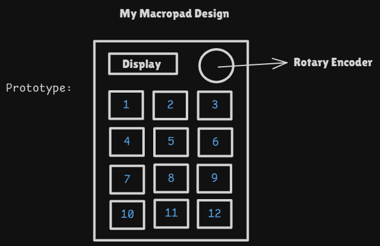

# June 11th: Getting the Design Finalised
 
> [!NOTE] 
> Though not visible in the design, I plan on adding MINI-E LED's to get an RGB look
## Functionality/Key-Mapping
- The **Display** to "display" (*pun intended*) random stuff, or something useful like computer stats?
- A **Rotary Encoder** with two types of user input (Push, and Rotation). Push to **pause/play audio**, and rotation to **control volume**
- **Row 1 Keys**
  - **Audio Control**: left key to **Reverse**, right key to **Skip**, and the middle key to **Open Spotify**
- **Other Keys**
  - Likely to map to other actions like **Pull/Push and Commit from GitHub**, etc. or some arbitrary shortcuts
> **Time Spent:** 45 mins